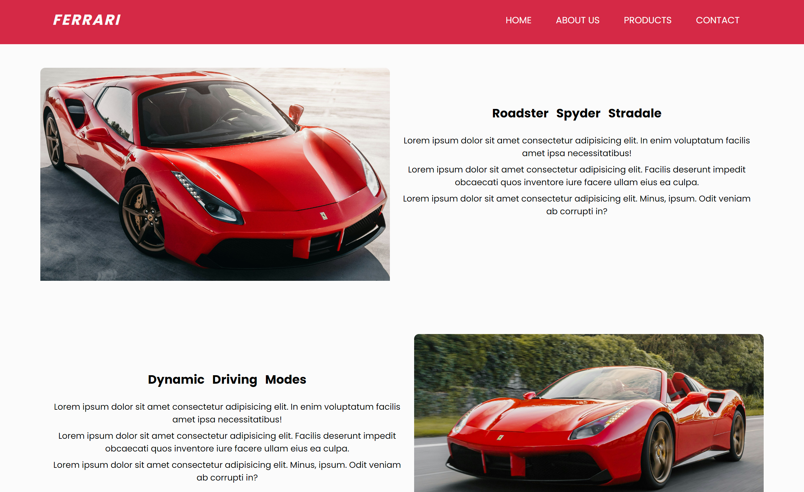

# Classless CSS Project

Modern website design without classes.

This project is a simple implementation of the classless CSS concept, which allows you to write only semantic HTML tags and style your page with tag names.

## Full Web Site

## Navigation Bar and Hero Content

## Articles

